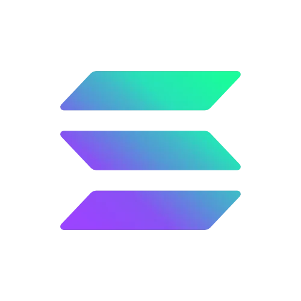
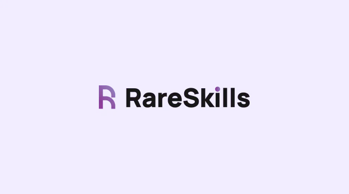

# Solana School



## Following the RareSkills Solana tutorial: [RareSkills Solana tutorial](https://rareskills.io/solana-tutorial)

## Quick start
 
Prereqs: Node.js, Rust/Cargo, Solana CLI, Anchor CLI

Run tests for a day:

```bash
cd day_XX
anchor test
```

Build/deploy:

```bash
anchor build
anchor deploy                 # localnet
# or
anchor deploy --provider.cluster devnet
```

Start a local validator:

```bash
solana-test-validator -r
```

Each day folder contains an Anchor program under `programs/` and tests under `tests/`.
